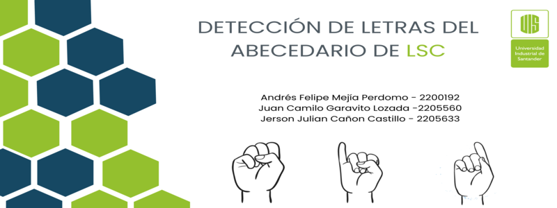
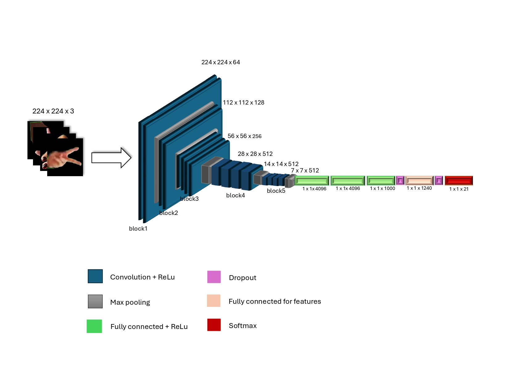

# DETECCIÓN DE LETRAS DEL ABECEDARIO DEL LENGUAJE DE SEÑAS COLOMBIANO (LSC)

## Autores:

 - Andrés Felipe Mejía Perdomo 
 - Juan Camilo Garavito Lozada 
 - Jerson Julian Cañon Castillo

## Objetivo
Predicción de letras del abecedario en Lenguaje de Señas Colombiano basada en imágenes para facilitar la comunicación de personas sordas en el país.

## Dataset 
https://www.kaggle.com/datasets/oscarstep/dataset-lsc-modelo

## Modelo

<a href="https://drive.google.com/file/d/1wP_dEXg44t--aesjE12xBkKwZrlgsMC-/view?usp=sharing" target="_blank">https://drive.google.com/file/d/1wP_dEXg44t--aesjE12xBkKwZrlgsMC-/view?usp=sharing</a>

## Enlace del video

<a href="https://www.youtube.com/watch?v=CBQv5MOtzQQ" target="_blank">https://www.youtube.com/watch?v=CBQv5MOtzQQ</a>
